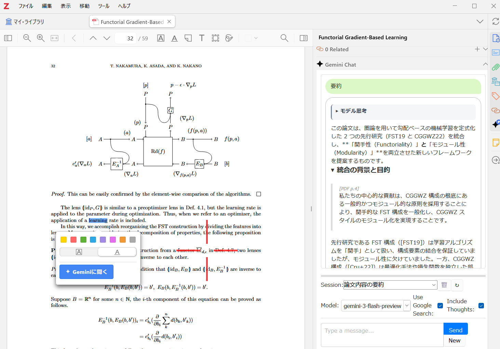

# Ask My Paper

Ask My Paper is a Zotero plugin that adds an LLM-powered chat panel to the
Zotero PDF reader.

The plugin is focused on in-reader workflows: you can ask questions about the
current PDF, send selected text to the selected provider, and keep chat history
associated with the Zotero item.

> [!IMPORTANT]
> This project is being developed with Codex assistance and is still under
> active iteration. Review behavior and outputs carefully before relying on it
> in production or research workflows.



## Current capabilities

- Adds a chat pane to the Zotero PDF reader
- Automatically uploads and synchronizes PDF attachments with the selected
  provider when chat starts
- Sends free-form prompts from inside Zotero
- Lets you ask about selected text from the reader context menu
- Stores all chat sessions for a Zotero item in one aggregate Ask My Paper data
  attachment
- Renders responses with Markdown and KaTeX support
- Supports configurable API key, system prompt, model list, title generation,
  and chat history limit

## How it works

When a chat starts, the plugin automatically uploads and synchronizes the PDF
attachments of the current Zotero item with the selected provider. Metadata for
uploaded files and chat sessions is stored in one aggregate Zotero attachment
per parent item.

## Setup

1. Build or install the plugin in Zotero.
2. Open Zotero Preferences and find `Ask My Paper Settings`.
3. Set your Gemini API key.
4. Optionally adjust:
   - system prompt
   - prompt used for selected text
   - available model list
   - title generation model and prompt
   - chat history limit

## Development

```bash
npm install
npm run start
```

For a production build:

```bash
npm run build
```

## Notes

- A valid provider API key is required.
- PDF files may be uploaded to the selected provider in order to provide
  document context.
- This repository is based on the Zotero plugin template and is still under
  active development.
